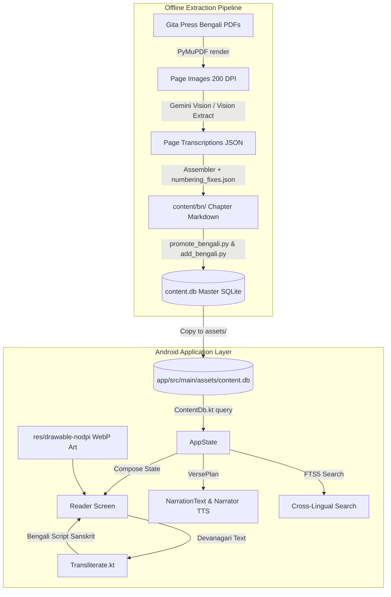

# CLAUDE.md

> **Shrimad Bhagavat Mahapuran — Android Application & Data Pipeline**
> Private, 100% offline, zero-gap multilingual digital scripture (Sanskrit, Bengali, Hindi, English) with Kangra miniature art, audio narration, and semantic/incident search.

---

## 1. Project Overview & Vision

### Purpose
The **Bhagavatam** project is an offline-first Android application delivering the complete **Shrimad Bhagavat Mahapuran** (Mahatmya + 12 Skandhas, 335 chapters, ~14,000 verses). It provides:
- **Zero-Gap Multilingual Scripture:** Sanskrit verses (Devanagari + automatic Bengali script transliteration), Hindi translation (Gita Press), Bengali translation (Gita Press Vol 1 & 2), and English translation.
- **Kangra / Pahari Miniature Art:** Distinctive traditional gouache paintings on aged paper for every Skandha and Chapter.
- **Human-Grade Narration:** Offline Android TTS with sentence-level chunking, natural pauses, Sanskrit reading via Hindi engine fallback, and background media playback (`MediaSessionService`).
- **Cross-Lingual Incident Search:** Full-text search (FTS5) and semantic incident lookup across English, Hindi, and Bengali.
- **Reader Annotations & Dictionary:** In-app bookmarks, highlights, personal notes, and word-by-word sandhi lookup.

---

## 2. Directory Structure & Key Files

```
Bhagavatam/
├── app/                                # Android Application (Kotlin + Jetpack Compose)
│   ├── src/main/
│   │   ├── assets/
│   │   │   └── content.db              # Shipped SQLite database (synced with content/content.db)
│   │   ├── java/com/bhagavatam/app/
│   │   │   ├── audio/                  # NarrationText, Narrator, FocusController, PlaybackService
│   │   │   ├── data/                   # ContentDb, Annotations, Strings, WordSearch, SettingsText
│   │   │   ├── state/                  # AppState (global state, reader pos, audio, settings)
│   │   │   ├── ui/                     # Compose UI (screens, components, theme, navigation)
│   │   │   │   ├── components/         # Bars, Art, MarkedText, Ornaments, Common UI
│   │   │   │   ├── screens/            # Home, Library, Reader, Player, Search, Settings, Me
│   │   │   │   └── theme/              # Color, Theme, Tokens, Type (Kesari Deep palette)
│   │   │   └── util/                   # Transliterate.kt (Devanagari -> Bengali script)
│   │   └── res/
│   │       ├── drawable-nodpi/         # Kangra WebP art (ch_S_C.webp, sk_SS.webp)
│   │       └── font/                   # Custom typefaces (Tiro, Literata, Mukta, etc.)
│   └── build.gradle.kts                # App-level build config (minSdk 26, targetSdk 34)
│
├── content/                            # Data Pipeline & Canonical Content
│   ├── _bengali/bn_extract/            # Gemini Vision Bengali PDF Extraction Engine
│   │   ├── vision_extract.py           # Gemini 2.5 Flash Vision extractor (pages -> JSON)
│   │   ├── bn_extract.py               # Assembler, verifier, gap detector, verse splitter
│   │   ├── data/                       # expected_verses.json, numbering_fixes.json
│   │   └── cache/                      # Rendered page images & raw transcription JSONs
│   ├── _build/                         # Promotion & SQLite Build Tools
│   │   ├── promote_bengali.py          # Promotes assembled Bengali chapters to content/bn/
│   │   ├── add_bengali.py              # Ingests Bengali chapters into content.db
│   │   └── build_db.py                 # Full SQLite database compiler
│   ├── art/                            # Kangra/Pahari art prompts (PROMPTS.md)
│   ├── bn/                             # Canonical Bengali chapter markdown files
│   ├── en/                             # Canonical English chapter markdown files
│   ├── hi/                             # Canonical Hindi chapter markdown files
│   └── content.db                      # Master canonical SQLite database
│
├── docs/                               # Comprehensive Documentation & Architecture Specs
│   ├── ARCHITECTURE.md                 # Deep-dive into Android client & Audio subsystem
│   ├── DATA_PIPELINE.md                # Bengali & Hindi extraction & verification guide
│   ├── ART_AND_ASSETS.md               # Kangra art prompt guidelines & asset pipeline
│   └── superpowers/plans/              # Detailed feature implementation plans
│
├── tools/                              # Automation Scripts
│   ├── generate_graphify.py            # AST Knowledge Graph generator (graphify-out/)
│   ├── import_art.py                   # Art converter (PNG -> 16:10 WebP -> res/drawable-nodpi)
│   └── make_chapter_prompts.py         # Batch art prompt generator
│
├── graphify-out/                       # Repository Knowledge Graph & Visualizer
├── DESIGN_SYSTEM.md                    # Kesari Deep UI Tokens & Typography Rules
└── CLAUDE.md                           # This Developer & AI Guide
```

---

## 3. Architecture & Data Flow



### Core Architectural Components:
1. **ContentDb (`app/data/ContentDb.kt`):**
   - Direct SQLite access to pre-compiled `content.db`.
   - Tables: `meta`, `skandha`, `chapter`, `verse`.
   - Queries support zero-latency verse loading, multi-language switching, and FTS5 search.
2. **Narration Subsystem (`app/audio/`):**
   - `NarrationText`: Sentence-level clause splitting, dialogue marker separation, Indic joiner cleaning, and pause calibration.
   - `Narrator`: Android TTS controller with one-verse lookahead queue, real silences via `playSilentUtterance`, and Hindi-voice fallback for Sanskrit.
   - `PlaybackService`: Android `MediaSessionService` foreground service for lock-screen and background audio.
3. **Transliteration Engine (`app/util/Transliterate.kt`):**
   - High-performance character mapping converting Sanskrit Devanagari into Bengali script on-the-fly when Bengali paath is selected.
4. **Design System (`app/ui/theme/`):**
   - **Kesari Deep:** Warm parchment (`#F7F4EE`) light mode (**Prabhat**), deep night (`#12141C`) dark mode (**Sandhya**), plus **Pothi** (sepia) and **Ratri** (OLED black).
   - 12 Distinct Skandha hues.
   - Custom Indic typography: Tiro Devanagari Hindi, Noto Serif Bengali, Mukta, Hind Siliguri, Literata, Plus Jakarta Sans.

---

## 4. Key Workflows & Common Commands

### A. Android Build & Execution
```powershell
# Build debug APK
.\gradlew.bat assembleDebug

# Run unit tests
.\gradlew.bat test

# Install to connected device/emulator
.\gradlew.bat installDebug
```

### B. Bengali Extraction Pipeline (`content/_bengali/bn_extract/`)
```powershell
# 1. Run vision extraction on specific page range (e.g. Skandha 7)
python vision_extract.py run --vol 1 --pages 788-879 --workers 2

# 2. Assemble extracted pages into chapters and audit gaps
python bn_extract.py assemble

# 3. Promote clean chapters to canonical content/bn/
python ../../_build/promote_bengali.py --force

# 4. Ingest into canonical DB and Android assets DB
python ../../_build/add_bengali.py ../../content.db
python ../../_build/add_bengali.py ../../../app/src/main/assets/content.db
```

### C. Art Asset Ingestion
```powershell
# Convert generated PNG art (16:10, 1280x800) to WebP and install in app
python tools/import_art.py path/to/image.png --name ch_0_1 --install
```

### D. Knowledge Graph Scan
```powershell
# Regenerate full AST knowledge graph in graphify-out/
python tools/generate_graphify.py
```

---

## 5. Strict Invariants & Coding Guidelines

1. **Zero-Gap Verse Integrity:**
   - No chapter may be promoted or ingested with missing or unaccounted verses.
   - All Gita Press combined verse units (e.g. `1-2`, `5-8`) and misprints must be explicitly documented in `numbering_fixes.json`.
2. **Punctuation & Typography Standards:**
   - **NO EM/EN DASHES:** Project rule forbids `—` and `–`. Use standard plain hyphens `-` surrounded by spaces or proper commas/dandas.
   - Sanskrit dandas `।` and `॥` must have no-break spaces to prevent orphaned verse markers on new lines.
3. **UI / Accessibility Rules:**
   - Minimum touch target: **48dp** with at least 8dp padding between adjacent touch targets.
   - Contrast ratio: WCAG AA compliant (minimum **4.5:1** for text, **3:1** for icons).
   - Respect system animation scale (`Motion` tokens).
   - Indic text font sizes must not drop below **15sp** with line-height multiplier **1.8**.
4. **Offline & Privacy First:**
   - All primary reading, listening, searching, and dictionary features must function 100% offline without requiring internet access or user login.
5. **Database Synchronization:**
   - Whenever `content/content.db` is modified or updated, `app/src/main/assets/content.db` **MUST** be updated simultaneously.

---

## 6. Project History & Key Decisions

- **Phase 1 (Foundation):** Prototype created with SampleData in Kotlin + Jetpack Compose.
- **Phase 2 (Design System & Theming):** Implemented **Kesari Deep** palette, Skandha color identities, four reader themes (Prabhat, Pothi, Sandhya, Ratri), and full typography tokenization.
- **Phase 3 (Full Database Migration):** Built Python SQLite compiler (`build_db.py`, `add_bengali.py`) packing complete Sanskrit, Hindi, English, and Bengali texts into high-performance `content.db`.
- **Phase 4 (Zero-Gap Bengali Vision Pipeline):** Deployed Gemini Vision extraction engine over Gita Press Volume 1 & 2 scans, extracting 1,100+ pages and resolving complex verse groupings with `numbering_fixes.json`.
- **Phase 5 (Audio & Narration Subsystem):** Engineered `NarrationText` clause splitter and `Narrator` TTS engine with lookahead queues, silent pauses, and `PlaybackService` background media integration.
- **Phase 6 (Kangra Art & Multi-Modal):** Integrated Kangra/Pahari miniature art prompts, 16:10 WebP background renderer, Bengali transliteration, and AST Knowledge Graphing.
