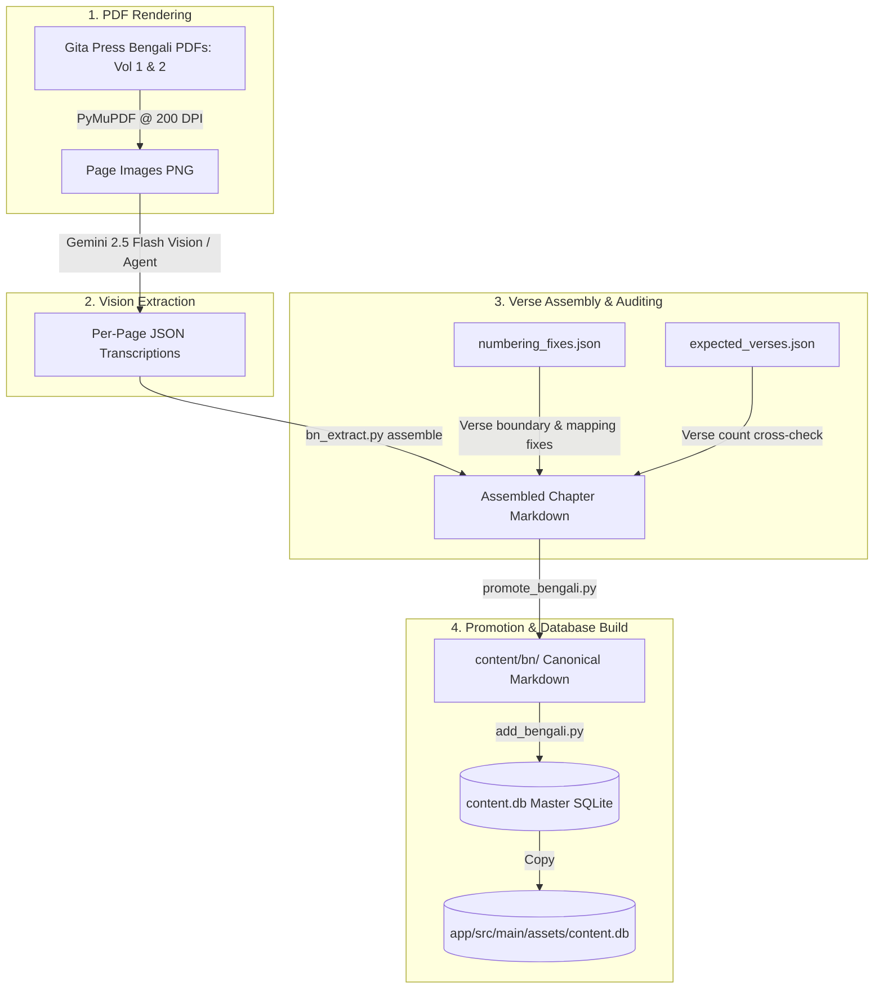

# Data Pipeline & Extraction Specification

> **Zero-Gap Multilingual Scripture Ingestion Pipeline**

---

## 1. Pipeline Overview

The Bhagavatam content pipeline guarantees **100% zero-gap coverage** across all 335 chapters and ~14,000 verses of the Shrimad Bhagavat Mahapuran.



---

## 2. Gemini Vision Extraction Engine (`content/_bengali/bn_extract/`)

### 2.1 Per-Page Extraction Schema
Each scanned PDF page is transcribed into structured JSON:
```json
{
  "volume": 1,
  "page_in_pdf": 788,
  "skandha": 7,
  "chapter_header": "সপ্তম স্কন্ধ - প্রথম অধ্যায়",
  "paragraphs_before_chapter_heading": 0,
  "paragraphs": [
    {
      "p_idx": 1,
      "text": "রাজা পরীক্ষিৎ জিজ্ঞাসা করিলেন...",
      "printed_marker": "॥ ১ ॥",
      "flag": null
    }
  ]
}
```

### 2.2 Offset Calibration (`paragraphs_before_chapter_heading`)
When a new chapter starts midway through a page:
- `paragraphs_before_chapter_heading` specifies how many paragraphs belong to the preceding chapter.
- The assembler routes those preceding paragraphs into the previous chapter's stream before starting the new chapter.

---

## 3. Resolving Gita Press Quirks (`numbering_fixes.json`)

Gita Press Bengali prints contain specific editorial patterns:
1. **Multi-Verse Units (Combined Translations):** Multiple shlokas (e.g. `॥ ১-২ ॥`, `॥ ১৫-১৮ ॥`) translated as a single prose paragraph.
2. **Shifted Marker Sequences:** Occasional misprinted markers in the original Bengali print.

Every correction is tracked with strict audit fields:
```json
{
  "section": "skandha-07",
  "chapter": 1,
  "printed": "॥ ১-২ ॥",
  "occurrence": 1,
  "is": "॥ ১-২ ॥",
  "why": "Verses 1 and 2 combined into single translation unit in Gita Press"
}
```

---

## 4. Verification & Promotion Flow

1. **Extraction:**
   ```powershell
   python vision_extract.py run --vol 1 --pages <start>-<end> --workers 2
   ```
2. **Assembly & Gap Audit:**
   ```powershell
   python bn_extract.py assemble
   ```
   *Verifies every verse from 1 to N against `expected_verses.json`.*
3. **Promotion:**
   ```powershell
   python ../../_build/promote_bengali.py --force
   ```
4. **Database Ingestion:**
   ```powershell
   python ../../_build/add_bengali.py ../../content.db
   python ../../_build/add_bengali.py ../../../app/src/main/assets/content.db
   ```
