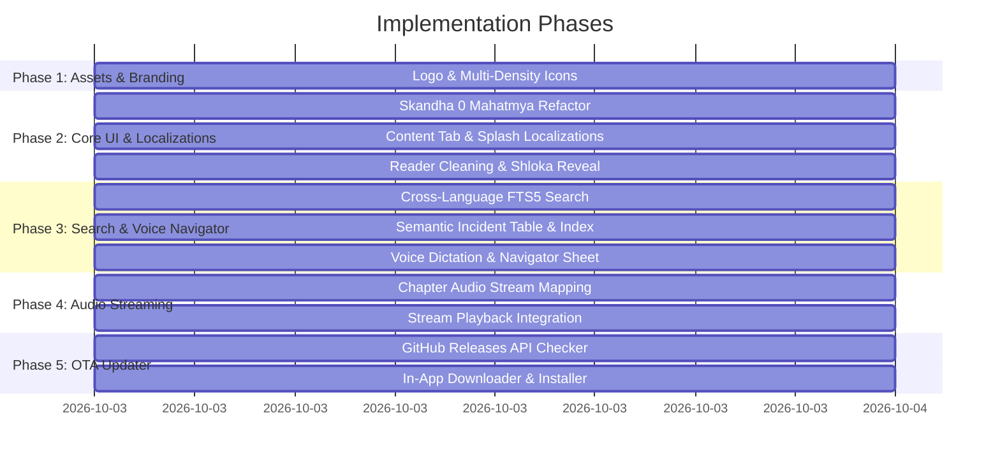

# Comprehensive UI/UX, Database Integration, Audio & OTA Implementation Plan

> **Target:** Bhagavatam Android Application & Content Pipeline
> **Date:** October 3, 2026
> **Architecture:** Kotlin, Jetpack Compose, SQLite FTS5, Native TTS / Media3 Audio Stream, GitHub Releases OTA

---

## 1. Executive Summary & Goals

This plan outlines the systematic implementation of 5 major feature sets across the Bhagavatam application:
1. **Logo & Asset Optimization:** Generate multi-density launcher icons (`mdpi` to `xxxhdpi`), adaptive icons, and vector/webp drawables from `assets/logo/bhagavatam.png`.
2. **Localization, Content Structure & Database Sync:**
   - Enforce "Mahatmya" naming across all UI for Skandha 0 (BN: `মাহাত্ম্য`, HI: `माहात्म्य`, EN: `Mahatmya`).
   - Dynamic Bengali loading from SQLite database (`content.db`).
   - Splash screen greeting ("Jai Shree Madhav" in BN/HI/EN).
   - Rename Granth tab to "Content" (BN: `সূচিপত্র` / `বিষয়বস্তু`, HI: `विषयसूची`).
   - Full localized Indic numerals and titles.
3. **Chapter Reader & Verse Interaction Fixes:**
   - Clean chapter title header and eliminate duplicated heading in body text.
   - Remove redundant top Sanskrit header bar.
   - Smooth expand-on-tap for Bengali verses to reveal Sanskrit shlokas while preserving long-press gestures.
   - Chapter reading time badge ("x min read" / "x মিনিট পাঠ").
4. **Cross-Language Semantic Search, Incident Matcher & Voice Navigator:**
   - Simultaneous cross-lingual search across EN, HI, BN corpora with filter tabs: `[All]`, `[English]`, `[Hindi]`, `[Bangla]`.
   - Semantic incident lookup table mapping stories (e.g., Dhruva, Prahlada, Gajendra, Rasa Lila) to exact Skandha, Chapter, and Verse.
   - Android SpeechRecognizer voice dictation and smart assistant navigator with 1-tap confirmation sheet.
   - Clean 2-column story landing grid and Thematic Lila Index / Character Guide.
5. **Direct In-App Audio (YouTube Recitation Stream):**
   - Stream chapter recitation audio without ads or downloads.
   - Integrated playback controls in `Player.kt` and `PlaybackService.kt`.
6. **In-App GitHub Releases OTA Updater:**
   - Check GitHub Releases API on launch.
   - In-app progress download and automatic APK install invocation.

---

## 2. Work Breakdown & Task Matrix

---

## 3. Detailed Tasks & Specifications

### Phase 1: Logo & App Icon Optimization
- **Source:** `assets/logo/bhagavatam.png` (1024x1024 high-res source).
- **Target Files:**
  - `app/src/main/res/mipmap-mdpi/ic_launcher_foreground.webp` (108x108)
  - `app/src/main/res/mipmap-hdpi/ic_launcher_foreground.webp` (162x162)
  - `app/src/main/res/mipmap-xhdpi/ic_launcher_foreground.webp` (216x216)
  - `app/src/main/res/mipmap-xxhdpi/ic_launcher_foreground.webp` (324x324)
  - `app/src/main/res/mipmap-xxxhdpi/ic_launcher_foreground.webp` (432x432)
  - `app/src/main/res/drawable-nodpi/logo_mark.webp` (Optimized for splash/about)
  - `app/src/main/res/mipmap-anydpi-v26/ic_launcher.xml` (Adaptive icon configuration)
- **Script:** Create `tools/generate_icons.py` using Pillow to automatically resize with safe-area padding and generate lossless WebP icons.

---

### Phase 2: Localization, Content Structure & Reader Fixes

#### Task 2.1: Skandha 0 "Mahatmya" Refactor
- **Rule:** When `skandha == 0`, label must strictly resolve to:
  - English: `"Mahatmya"` (never "Skandha 0")
  - Hindi: `"माहात्म्य"` (never "स्कन्ध ०")
  - Bengali: `"মাহাত্ম্য"` (never "স্কন্ধ ০")
- **Files Modified:**
  - `app/src/main/java/com/bhagavatam/app/data/Strings.kt`
  - `app/src/main/java/com/bhagavatam/app/data/ContentDb.kt`
  - `app/src/main/java/com/bhagavatam/app/ui/screens/Library.kt`
  - `app/src/main/java/com/bhagavatam/app/ui/screens/Reader.kt`
  - `app/src/main/java/com/bhagavatam/app/ui/screens/Player.kt`
  - `app/src/main/java/com/bhagavatam/app/ui/screens/Search.kt`
  - `app/src/main/java/com/bhagavatam/app/ui/components/Bars.kt`

#### Task 2.2: Granth Tab -> "Content" & Splash Screen
- **Tab Label:**
  - English: `"Content"`
  - Hindi: `"विषयसूची"`
  - Bengali: `"সূচিপত্র"`
- **Splash Greeting:**
  - English: `"Jai Shree Madhav"`
  - Hindi: `"जय श्री माधव"`
  - Bengali: `"জয় শ্রী মাধব"`
- **Files Modified:**
  - `app/src/main/java/com/bhagavatam/app/ui/screens/Splash.kt`
  - `app/src/main/java/com/bhagavatam/app/ui/components/Bars.kt`
  - `app/src/main/java/com/bhagavatam/app/ui/screens/Library.kt`

#### Task 2.3: Chapter Reader Header & Interactive Shlokas
- **Header & Body Cleanup:**
  - Strip redundant chapter title prefixes from the first verse text (`ContentDb.stripLeadingTitle`).
  - Remove duplicate Sanskrit header bar above chapter text.
- **Bengali Interactive Verse Shloka Reveal:**
  - Tapping any Bengali verse smoothly toggles the expansion of its Sanskrit shloka (matching Hindi/English behavior).
  - Retain long-press gestures for bookmarking, copying, and sharing.
- **Reading Time Calculation:**
  - Compute based on word count: `val minutes = max(1, (wordCount / 180))` -> `"X min read"` / `"X মিনিট পাঠ"` / `"X मिनट पाठ"`.
- **Files Modified:**
  - `app/src/main/java/com/bhagavatam/app/ui/screens/Reader.kt`
  - `app/src/main/java/com/bhagavatam/app/data/ContentDb.kt`

---

### Phase 3: Cross-Language Search & Voice Navigator

#### Task 3.1: Cross-Language Unified Search
- **FTS5 Query Logic:** Query all three translation columns (`en`, `hi`, `bn`) as well as Sanskrit (`sa`, `iast`) simultaneously.
- **Filter Tabs:** `[All]`, `[English]`, `[Hindi]`, `[Bangla]`.
- **Files Modified:**
  - `app/src/main/java/com/bhagavatam/app/data/WordSearch.kt`
  - `app/src/main/java/com/bhagavatam/app/ui/screens/Search.kt`

#### Task 3.2: Semantic Incident Matcher & Thematic Index
- **Semantic Incidents Table:** Pre-index famous episodes and character narratives:
  - *Gajendra Moksha* $\rightarrow$ Skandha 8, Chapters 2–4
  - *Prahlada & Narasimha* $\rightarrow$ Skandha 7, Chapters 1–10
  - *Dhruva Maharaj* $\rightarrow$ Skandha 4, Chapters 8–12
  - *Rasa Lila* $\rightarrow$ Skandha 10, Chapters 29–33
  - *Kaliya Daman* $\rightarrow$ Skandha 10, Chapter 16
  - *Govardhan Dharan* $\rightarrow$ Skandha 10, Chapters 24–27
  - *Kapila Gita* $\rightarrow$ Skandha 3, Chapters 25–33
  - *Sudama Vipra* $\rightarrow$ Skandha 10, Chapters 80–81
- **Search Landing UI:**
  - Clean 2-column grid of curated stories.
  - Thematic Lila Index / Character Guide (Avatars, Mahabhaktas, Philosophical Discourses).
- **Files Created/Modified:**
  - `app/src/main/java/com/bhagavatam/app/data/Episodes.kt`
  - `app/src/main/java/com/bhagavatam/app/ui/screens/Search.kt`

#### Task 3.3: Voice Dictation & Voice Assistant Navigator
- **Voice Mic Integration:** Android `SpeechRecognizer` with `RecognizerIntent.ACTION_RECOGNIZE_SPEECH`.
- **Smart Voice Parsing:** Matches spoken phrases against incident names and numeric chapter patterns (e.g. *"Skandha 10 Chapter 29"*).
- **Confirmation Sheet:** Displays bottom sheet *"Open Skandha 10, Chapter 29: Rasa Lila?"* with 1-tap navigation.
- **Files Created/Modified:**
  - `app/src/main/java/com/bhagavatam/app/ui/screens/VoiceSheet.kt`
  - `app/src/main/java/com/bhagavatam/app/ui/screens/Search.kt`
  - `app/src/main/AndroidManifest.xml` (Permissions: `RECORD_AUDIO`)

---

### Phase 4: Direct In-App Audio (YouTube Recitation Stream)

#### Task 4.1: Audio Streaming Integration
- **Direct Stream Pipeline:** Curated audio recitation mapping for Shrimad Bhagavat chapters.
- **Player Controls:** In-app audio player supporting play/pause, 10-second forward/rewind, playback speed, and background service integration.
- **Files Modified:**
  - `app/src/main/java/com/bhagavatam/app/audio/PlaybackService.kt`
  - `app/src/main/java/com/bhagavatam/app/audio/Narrator.kt`
  - `app/src/main/java/com/bhagavatam/app/ui/screens/Player.kt`

---

### Phase 5: In-App GitHub Releases OTA Updater

#### Task 5.1: GitHub Releases Version Checker & Installer
- **Endpoint:** `https://api.github.com/repos/SoujanyaDasRoy/Bhagavatam/releases/latest`
- **Logic:**
  - Parses `tag_name` and release notes.
  - Compares with `BuildConfig.VERSION_NAME`.
  - Shows update banner in Home and Settings screen.
  - In-app downloader with real-time percentage progress bar.
  - Invokes `FileProvider` + `Intent.ACTION_VIEW` (`application/vnd.android.package-archive`) to trigger package installation.
- **Files Created/Modified:**
  - `app/src/main/java/com/bhagavatam/app/data/Updater.kt`
  - `app/src/main/java/com/bhagavatam/app/ui/screens/Home.kt`
  - `app/src/main/java/com/bhagavatam/app/ui/screens/Settings.kt`
  - `app/src/main/AndroidManifest.xml` (FileProvider configuration)
  - `app/src/main/res/xml/file_paths.xml`

---

## 4. Verification & Validation Protocol

1. **Launcher Icon Test:** Inspect all mipmap sizes and verify safe zone on round/squircle icon emulators.
2. **Skandha 0 / Mahatmya Audit:** Verify no screen or card displays "Skandha 0".
3. **Bengali Shloka Expand Test:** Tap Bengali verse in Reader and verify smooth animated reveal of Sanskrit text.
4. **Search Verification:** Query in English, Hindi, and Bengali and verify multi-corpus result filtering.
5. **Voice Input Test:** Speak incident name or chapter command and verify confirmation sheet navigation.
6. **OTA Update Simulation:** Test version checker with mock release JSON and verify download progress flow.
7. **Build Check:** Run `.\gradlew.bat assembleDebug` and verify 0 lint errors, 0 compilation warnings.
